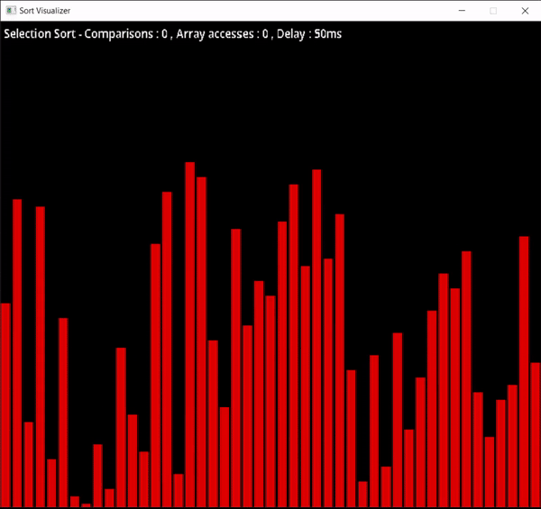
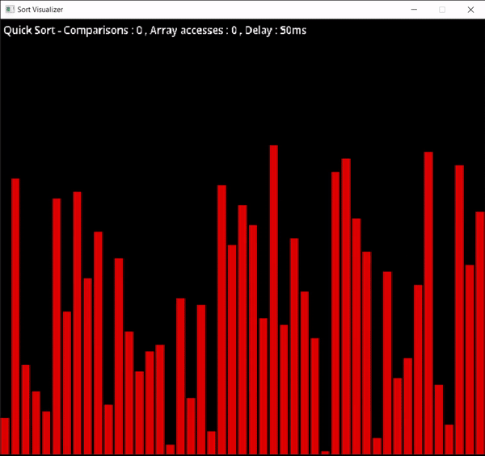
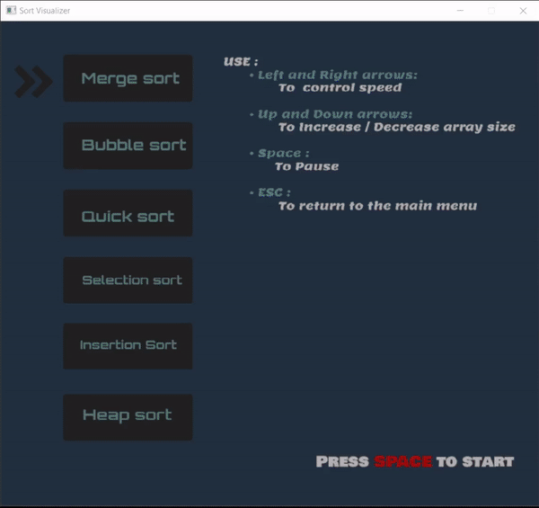

# SortingVisualization
Sort ALgorithms Visualized with SDL2.


## Demo

### Merge sort
<p align="center">
  
</p>

### Bubble sort
<p align="center">
  
</p>

### Selection sort
<p align="center">
  
</p>

### Insertion sort
<p align="center">
  
</p>

### Quick sort
<p align="center">
  
</p>

### Heap sort
<p align="center">
  
</p>

### Main minu 
<p align="center">
  
</p>


## How to run

### On Linux :

* Install cmake and sdl2.
```bash
sudo apt Install cmake libsdl2-dev
```

* Install sdl2-image 
```bash 
sudo apt install libsdl2-image-dev
```

* Install sdl2-ttf 
```bash 
sudo apt-get install libsdl2-ttf-dev
```

<br/>

* Clone the repo 
```bash 
git clone https://github.com/mohammed0xff/SortingVisualization
```

* Make n Run

```bash
cd SortingVisualization/SortingVisualization
```
```bash
cmake . && make 
```
```bash
./sortVisualizer 
```

<br/>

### On Windows : 

* Open `SortingVisualization.sln` file
* Follow [lazy foo](https://lazyfoo.net/tutorials/SDL/01_hello_SDL/windows/msvc2019/index.php) guide to set up SDL2 on Visual Studio.
* Press `F5` to build and run the program.

